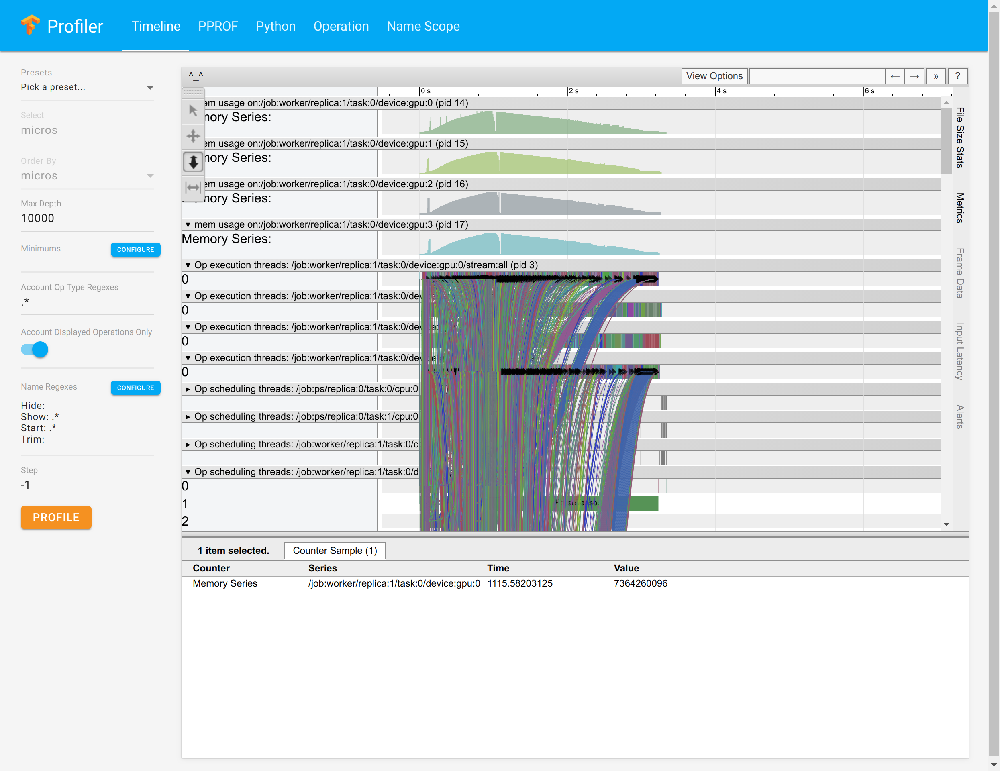

# TensorFlow Profiler UI

The TensorFlow Profiler (TFProf) UI provides a visual interface for profiling TensorFlow models.

# Installation
1) Install Python dependencies.
   ```s
   pip install --user -r requirements.txt
   ```
2) Install [pprof](https://github.com/google/pprof#building-pprof).
3) Create a profile context file using the [tf.contrib.tfprof.ProfileContext](https://github.com/tensorflow/tensorflow/blob/v1.8.0/tensorflow/python/profiler/profile_context.py#L110-L148) class.
3) Start the UI.
   ```s
   python ui.py --profile_context_path=/path/to/your/profile.context
   ```

# Learn more
You can learn more about the TensorFlow Profiler's Python API and CLI [here](https://github.com/tensorflow/tensorflow/blob/master/tensorflow/core/profiler/README.md#quick-start).

# Screenshot


# Browser Support
Currently only [Chrome](https://www.google.com/chrome/) is supported.

# Contributing
Please see [our contributor's guide](/CONTRIBUTING.md)
